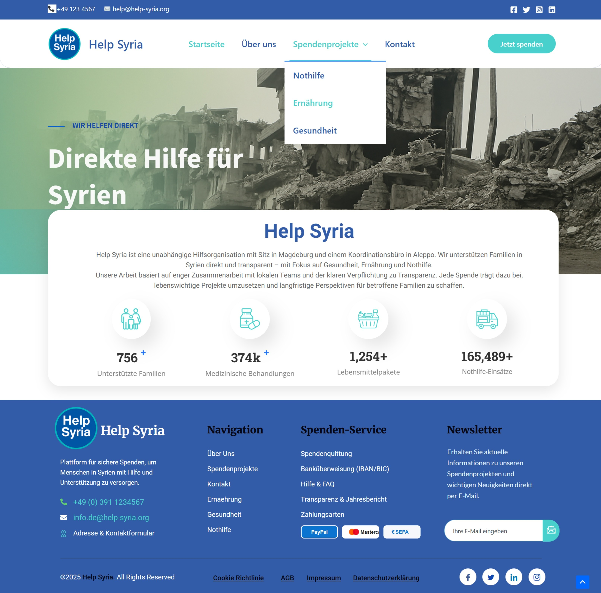
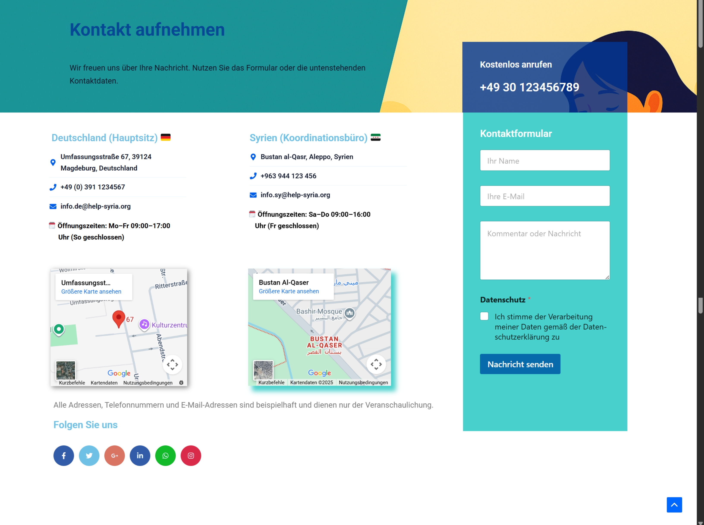

# Bachelorarbeit – Spendenwebseite

Dieses Projekt entstand im Rahmen meiner Bachelorarbeit im Studiengang Wirtschaftsinformatik.

## Projektbeschreibung
Konzeption und Umsetzung einer funktionalen Spendenwebseite für kleine Organisationen mit Fokus auf Benutzerfreundlichkeit, visuelle Vertrauensbildung und klare Seitenstruktur.

## Meine Aufgaben
- Konzeption der Seitenstruktur und Nutzerführung  
- Gestaltung von UI/UX und visuellen Elementen  
- Nutzung einer MySQL-Datenbank zur Verwaltung von Inhalten und Formularen  
- Ableitung von Designentscheidungen auf Basis einer eigenen Nutzerbefragung  

## Technologien
- WordPress  
- HTML, CSS, JavaScript
- UX/UI Design  

## Hinweise
Der vollständige Quellcode ist nicht enthalten, da die Umsetzung mit WordPress erfolgte.  
Dieses Repository dient zur Dokumentation des Projekts und meiner Arbeit daran.

## Screenshots

### Startseite

### Spendenseite
  

### Kontaktseite

